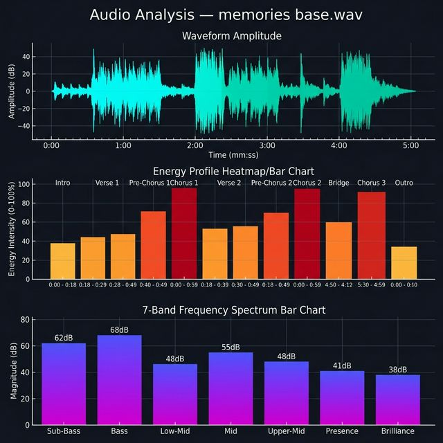
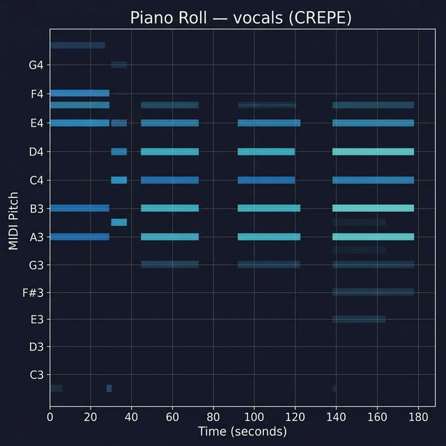

# 🎤 Songwriter Toolkit

[](https://opensource.org/licenses/MIT)
[](https://www.python.org/downloads/)

An AI-powered creative pipeline for writing rap lyrics, analyzing audio, storyboarding music videos, and generating Veo3 video prompts with start frames.

Built as a global skill for [Antigravity](https://antigravity.dev) — the AI coding assistant.

---

## What It Does

```
BEAT/AUDIO → Analyze → STEMS → MIDI → WRITE LYRICS → Suno Paste → STORYBOARD → Start Frames → VEO3 Generate
```

| Tool | Description |
|------|-------------|
| **Songwriter Skill** | Expert rap lyricist & Suno-format specialist — writes original lyrics across all hip-hop subgenres |
| **Audio Analyzer** | BPM, key, energy profile, section detection, spectrum analysis, mood classification from any audio file |
| **Stem Extractor** | Separates audio into individual stems (vocals, drums, bass, other) using Meta's Demucs |
| **MIDI Extractor** | High-quality audio-to-MIDI conversion with CREPE, pYIN, and basic-pitch backends |
| **Veo3 Prompter** | Converts Suno-formatted lyrics into scene-by-scene video generation prompts |
| **Start Frame Generator** | Creates visual start frames for Veo3 using AI image generation |

---

## Quick Start

### Install Dependencies

```bash
pip install -r requirements.txt
```

### Analyze a Beat

```bash
python scripts/audio_analyzer.py "path/to/beat.wav" --output text --plot
```

Output includes:
- **BPM** with confidence score
- **Musical key** (Krumhansl-Kessler detection)
- **Energy profile** — 16-segment map with peak/drop detection
- **Section boundaries** — intro, verse, chorus, bridge, outro
- **Frequency spectrum** — 7-band analysis (sub-bass through brilliance)
- **Mood** — dark, aggressive, melancholic, euphoric, etc.
- **Suno style prompt** — auto-generated, paste-ready

### Spectral Analysis Output

<p align="center">
  
</p>

> Waveform, energy profile, and 7-band frequency spectrum generated by the audio analyzer with `--plot`.
- **Visual plots** — waveform, energy map, spectrum (with `--plot`)

### Generate Video Storyboard

```bash
python scripts/veo3_prompter.py "path/to/lyrics.txt" --style cinematic --title "Song Title"
```

Visual styles: `cinematic` | `performance` | `abstract` | `narrative` | `hybrid`

### Interactive Mode

```bash
python scripts/veo3_prompter.py --interactive
```

---

## The Creative Pipeline

The full workflow from beat to music video:

```
1. ANALYZE     →  Run audio analyzer on a beat or reference track
2. WRITE       →  Write lyrics informed by BPM, key, mood, and section structure
3. SUNO        →  Paste lyrics + auto-generated style prompt into Suno
4. STORYBOARD  →  Generate scene-by-scene Veo3 prompts from the lyrics
5. START FRAMES → Generate AI start frame images for key scenes
6. VEO3        →  Upload start frames + scene prompts to generate video clips
7. POLISH      →  Iterate on lyrics, prompts, and frames together
```

Each step can be run independently — enter the pipeline at any point.

---

## Audio Analyzer

Analyzes any audio file (MP3, WAV, FLAC, OGG) using `librosa` and returns structured data for lyric writing.

```bash
# Full report with plots
python scripts/audio_analyzer.py "track.mp3" --output full --plot

# JSON for programmatic use
python scripts/audio_analyzer.py "beat.wav" --output json

# Text report only
python scripts/audio_analyzer.py "demo.flac" --output text
```

### Example Output

```
🎵 AUDIO ANALYSIS REPORT
==================================================
  File:     memories base.wav
  Duration: 0:05:11
  BPM:      129 (confidence: 65.1%)
  Key:      A# minor (confidence: 74.1%)

🎭 MOOD
  Detected: dark, aggressive, intense, vibrant

📊 ENERGY PROFILE
  Energy Map: ▓▓█████▓█▓██████

🔊 SPECTRUM
  Dominant: bass — punchy, warm bass foundation
  Sub-bass: 37.3%  |  Bass: 48.0%

📐 DETECTED SECTIONS
  [1]     intro | 0:00:00 — 11.3s
  [2]    chorus | 0:00:11 — 18.2s
  [6]     verse | 0:01:10 — 34.4s
  ...

🎹 SUNO STYLE PROMPT
  [trap, 129 BPM, A# minor, dark, aggressive, heavy 808s, minor key synths]
```

### How It Helps Write Better Lyrics

| Analysis | Lyric Impact |
|----------|-------------|
| **BPM** | Determines syllable density, double-time viability, flow architecture |
| **Key** | Minor = darker vocabulary; major = brighter mood |
| **Energy profile** | Place hardest bars at energy peaks, bridges at dips |
| **Sections** | Write to the beat's structure instead of imposing a template |
| **Spectrum** | 808-heavy = punchier, slower delivery; hi-hat-forward = faster, more percussive |

---

## Stem Extractor

Separates audio into individual stems using [Meta's Demucs](https://github.com/facebookresearch/demucs). Outputs isolated vocals, drums, bass, and other — ready for MIDI extraction or remixing.

```bash
# Default model (fast)
python scripts/stem_extractor.py "track.mp3"

# Fine-tuned model (better quality)
python scripts/stem_extractor.py "track.mp3" --model htdemucs_ft --output ./stems

# 6-stem model (adds guitar + piano separation)
python scripts/stem_extractor.py "track.mp3" --model htdemucs_6s --format flac

# Vocals only
python scripts/stem_extractor.py "track.mp3" --vocals-only
```

### Models

| Model | Stems | Character |
|-------|-------|-----------|
| **htdemucs** | vocals, drums, bass, other | Hybrid Transformer — fast, good quality |
| **htdemucs_ft** | vocals, drums, bass, other | Fine-tuned — better quality, slower |
| **htdemucs_6s** | vocals, drums, bass, guitar, piano, other | 6-stem model |
| **mdx_extra** | vocals, drums, bass, other | MDX-Net — alternative quality profile |

---

## MIDI Extractor

Converts isolated stems (or any audio) into clean MIDI files. Uses the best backend for each stem type.

```bash
# Best quality vocal MIDI (CREPE neural pitch)
python scripts/midi_extractor.py "vocals.wav" --backend crepe

# Quick extraction (pYIN, no extra deps)
python scripts/midi_extractor.py "vocals.wav" --backend pyin

# Polyphonic content (chords, keys, full mix)
python scripts/midi_extractor.py "other.wav" --backend basic

# Full stem pipeline (auto-selects best backend per stem)
python scripts/midi_extractor.py --stems-dir "./stems/htdemucs_ft/trackname"
```

### Backends

| Backend | Best For | Quality | Speed |
|---------|----------|---------|-------|
| **crepe** | Vocals, bass (monophonic) | ⭐⭐⭐ Neural pitch detection | Moderate |
| **pyin** | Monophonic content | ⭐⭐ Probabilistic YIN | Fast |
| **basic** | Chords, keys, full mix (polyphonic) | ⭐ Multi-pitch | Moderate |

### Piano Roll Output

<p align="center">
  
</p>

> Piano roll visualization showing extracted MIDI notes with `--save-plot`. Color intensity maps to note velocity/confidence.

---

## Veo3 Prompter

Converts Suno-formatted lyrics into a complete music video storyboard with individual scene prompts.

```bash
python scripts/veo3_prompter.py "lyrics.txt" --style hybrid --title "Memories Don't Die"
```

### Style Presets

| Style | Character |
|-------|-----------|
| **Cinematic** | Film-grade, shallow DOF, lens flares, anamorphic widescreen |
| **Performance** | Stage energy, strobes, crowd shots, sweat and grit |
| **Abstract** | Surreal, fluid, impossible geometry, particle effects |
| **Narrative** | Story-driven, character-focused, emotional arcs |
| **Hybrid** | Mix of performance + cinematic, world-switching |

### Per-Scene Output

Each scene includes:
- ✅ **Veo3 prompt** — copy-paste ready
- 🎥 **Camera direction** — movement type, lens, angle
- 💡 **Lighting setup** — source, color, direction
- 🏃 **Motion notes** — what moves and how
- 🎭 **Mood** — emotional register
- 🔄 **Transition** — how to cut to the next scene
- ❌ **Negative prompt** — what to avoid

---

## Start Frame Generation

Veo3 produces better results with start frames — images that anchor the visual style.

When used as an Antigravity skill, the toolkit can generate start frames using AI image generation for key emotional beats:

- **Intro** — establishes color grade and mood
- **First hook** — defines the performance space
- **Bridge** — nails the vulnerability moment
- **The turn** — the most important visual shift
- **Outro** — the final image

See `templates/veo3_scene_template.md` for start frame prompting best practices.

---

## Installing as an Antigravity Skill

Copy the `skill/` directory into your Antigravity skills folder:

```powershell
# Windows — copy
Copy-Item -Recurse skill\* "$env:USERPROFILE\.gemini\antigravity\skills\songwriter\"

# Windows — symlink (keeps in sync with repo)
New-Item -ItemType Junction `
  -Path "$env:USERPROFILE\.gemini\antigravity\skills\songwriter" `
  -Target "$(Get-Location)\skill"
```

```bash
# macOS/Linux — symlink
ln -s "$(pwd)/skill" ~/.gemini/antigravity/skills/songwriter
```

The skill activates automatically when you ask your AI assistant to write songs, analyze beats, or create music video storyboards.

---

## Supported Genres

| Genre | BPM Range | Character |
|-------|-----------|-----------|
| **Trap** | 120–135 | 808 focus, hi-hat rolls, flex/street themes, melodic hooks |
| **Drill** | 140–160 | Dark, menacing, staccato flow (UK/NY/Chicago) |
| **Grime** | 135–145 | High energy, choppy flow, London MC energy |
| **Boom Bap** | 85–100 | Sample-based, lyrical depth, complex rhyme schemes |
| **Cloud Rap** | 60–80 | Dreamy, lo-fi, detached delivery, atmospheric |
| **Rage** | 140–170 | Distorted 808s, aggressive triplet flow |
| **Melodic Rap** | 120–145 | Auto-tune hooks, emotional vulnerability + bars |
| **Phonk** | 120–140 | Southern-influenced, cowbell, dark aesthetics |
| **Southern Rap** | 65–85 | Slow drawl, double-time shifts, regional texture |
| **Underground** | Any | Experimental structure, raw authenticity |

---

## Project Structure

```
songwriter/
├── README.md                           # This file
├── requirements.txt                    # Python dependencies
├── .gitignore                          # Ignores audio, caches, IDE files
├── LICENSE                             # MIT
├── docs/
│   └── images/
│       ├── spectral_analysis.png       # Audio analyzer output sample
│       └── piano_roll.png              # MIDI extractor output sample
├── skill/
│   └── SKILL.md                        # Antigravity skill definition
├── scripts/
│   ├── audio_analyzer.py               # Audio analysis engine
│   ├── stem_extractor.py               # Demucs stem separation
│   ├── midi_extractor.py               # Audio-to-MIDI conversion
│   └── veo3_prompter.py                # Video storyboard generator
├── examples/
│   ├── memories_dont_die/
│   │   ├── lyrics.txt                  # Dark trap @ 129 BPM, A# minor
│   │   └── analysis.txt                # Audio analysis output
│   └── car_crash/
│       └── lyrics.txt                  # Club banger @ 140 BPM, grime/east coast
└── templates/
    ├── suno_style_prompts.md           # Suno style prompt reference (all genres)
    └── veo3_scene_template.md          # Veo3 prompt structure + energy mapping
```

---

## Requirements

- Python 3.10+
- [librosa](https://librosa.org/) — audio analysis
- [numpy](https://numpy.org/) — numerical computation
- [scipy](https://scipy.org/) — signal processing
- [soundfile](https://pysoundfile.readthedocs.io/) — audio I/O
- [matplotlib](https://matplotlib.org/) — visualization (optional, for `--plot`)
- [demucs](https://github.com/facebookresearch/demucs) — stem separation (optional)
- [torch](https://pytorch.org/) — deep learning runtime (for Demucs & CREPE)
- [basic-pitch](https://github.com/spotify/basic-pitch) — polyphonic MIDI extraction (optional)

---

## License

MIT — see [LICENSE](LICENSE) for details.
